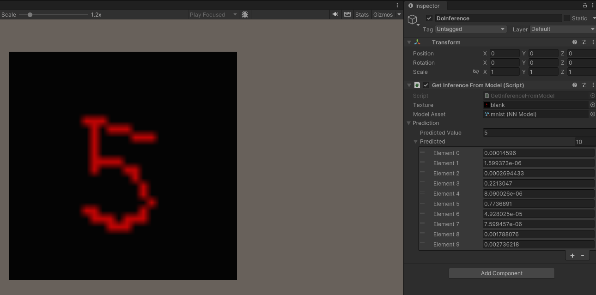

# MNIST Digit Recognition with Tensorflow and Barrracuda

Train create and train a tensorflow model on the MNIST data set and use this model to do digit recognition in Unity3D. 

## Workflow and Resources 

1. Create and train the model, save it using the SavedModel format
    - https://www.tensorflow.org/guide/saved_model

2. Convert the saved model to the ONNX format with the CLI tool of `tf2onnx`
    - https://docs.unity3d.com/Packages/com.unity.barracuda@1.0/manual/Exporting.html
    - https://onnx.ai/
    - Opset: https://github.com/onnx/onnx/releases

3. Validate the converted model with `onnxruntime`
    - https://onnxruntime.ai/docs/tutorials/tf-get-started.html -> code snippets
    - https://onnxruntime.ai/docs/api/python/api_summary.html
4. Use it as an Unity asset and do inference with the help of the Barracuda package. This is based on the video tutorial [Introduction to Using Machine Learning in Unity](https://youtu.be/ggmArUbRvC4) by Alec G. Moore, the relevant C# code is available at https://github.com/keijiro/MnistBarracuda. 
    - To do this the Baracuda package has to be added to Unity from the Git URL (or `com.unity.barracuda`)

The steps 1-3 are done in the `mnist_tf-onnx/tf_onnx_coversion.ipynb` notebook, the Unity project can be found in `3DMNIST_Barracuda/`.
